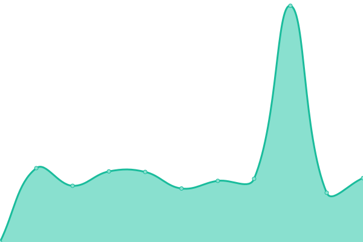

# [📈 Live Status](https://mendoanjoe.github.io/watcher): <!--live status--> **🟥 Complete outage**

This repository contains the open-source uptime monitor and status page for [Firmansyah Nuralif Rohman](https://mendoanjoe.github.io/watcher), powered by [Upptime](https://github.com/upptime/upptime).

With [Upptime](https://upptime.js.org), you can get your own unlimited and free uptime monitor and status page, powered entirely by a GitHub repository. We use [Issues](https://github.com/mendoanjoe/watcher/issues) as incident reports, [Actions](https://github.com/mendoanjoe/watcher/actions) as uptime monitors, and [Pages](https://mendoanjoe.github.io/watcher) for the status page.

<!--start: status pages-->
<!-- This summary is generated by Upptime (https://github.com/upptime/upptime) -->
<!-- Do not edit this manually, your changes will be overwritten -->
<!-- prettier-ignore -->
| URL | Status | History | Response Time | Uptime |
| --- | ------ | ------- | ------------- | ------ |
|  [Telkomsel PAS](https://pastiadasolusi.com) | 🟥 Down | [telkomsel-pas.yml](https://github.com/mendoanjoe/watcher/commits/HEAD/history/telkomsel-pas.yml) | 

 1339ms
     
 | 

<a href="https://mendoanjoe.github.io/watcher/history/telkomsel-pas">95.17%</a>
    

|  [Telkomsel PAS REST](https://api.pastiadasolusi.com) | 🟥 Down | [telkomsel-pas-rest.yml](https://github.com/mendoanjoe/watcher/commits/HEAD/history/telkomsel-pas-rest.yml) | 

 1015ms
     
 | 

<a href="https://mendoanjoe.github.io/watcher/history/telkomsel-pas-rest">100.00%</a>
    

|  [Telkomsel PAS BUCKET](https://bucket.pastiadasolusi.com) | 🟥 Down | [telkomsel-pas-bucket.yml](https://github.com/mendoanjoe/watcher/commits/HEAD/history/telkomsel-pas-bucket.yml) | 

 617ms
     
 | 

<a href="https://mendoanjoe.github.io/watcher/history/telkomsel-pas-bucket">100.00%</a>
    

<!--end: status pages-->

[**Visit our status website →**](https://mendoanjoe.github.io/watcher)

## 📄 License

- Powered by: [Upptime](https://github.com/upptime/upptime)
- Code: [MIT](./LICENSE) © [Firmansyah Nuralif Rohman](https://mendoanjoe.github.io/watcher)
- Data in the `./history` directory: [Open Database License](https://opendatacommons.org/licenses/odbl/1-0/)
